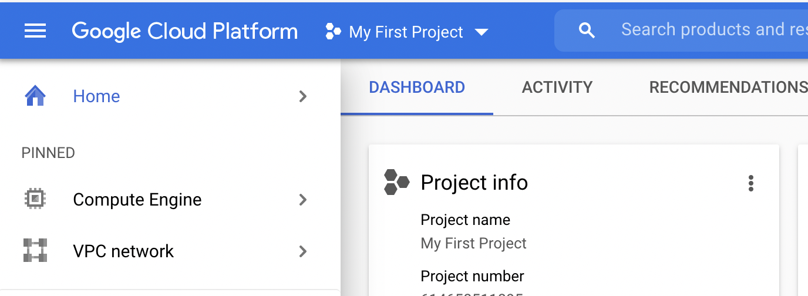
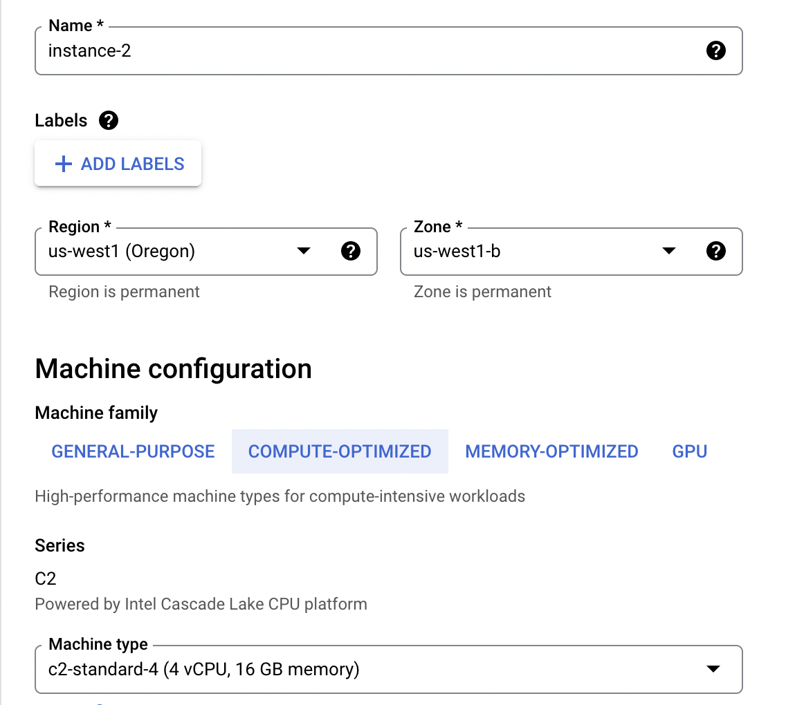
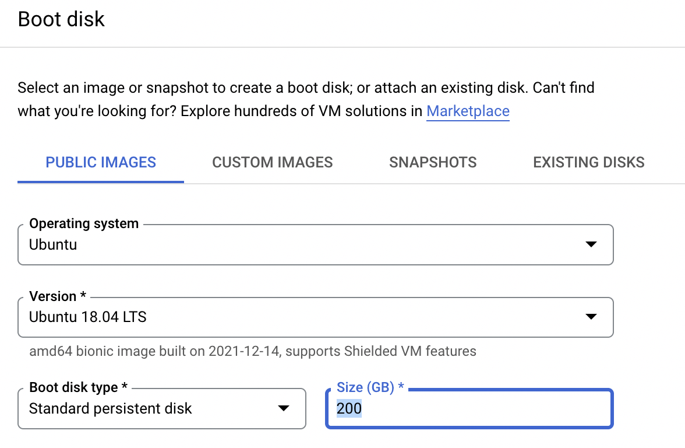

# Project setup in google cloud compute engine 
Go to Google Cloud and find the project tab, add a new project and follow instructions. 



In the following you will create a VM (virtual machine) instance and setup networking settings. 

# Install and initialize Cloud SDK in local machine
Cloud SDK is a set of tools that you can use to manage resources and applications hosted on Google Cloud from a terminal in your local machine. 

Download installer and follow instructions outlined [here](https://cloud.google.com/sdk/docs/install).


After installation has completed open a terminal in your local machine and navigate to the directory containing the new “google-cloud-sdk” directory. Run the following command and follow the on-screen instructions. Hitting enter for all prompts should generally be sufficient.

    ./google-cloud-sdk/install.sh

Initialize the SDK

Open a new terminal and run the command

    gcloud init

Log in when prompted (the login window will pop up in your browser, log in using your Google account). Pick the cloud project to use, using the unique id assigned to the project you created above. 


*Cheat sheet*: https://cloud.google.com/sdk/docs/cheatsheet 

# VM-instance setup 
Go to `Compute Engine` and click `CREATE INSTANCE`. Fill in required settings using the following as a guide: 






## Networking settings 
Use this to enable accessing Jupyter notebooks from a browser in local machine. 
- Go to `VPC network` > `External IP addresses`, and make external IP as Static. 
- Go to `Firewall` and Click `CREATE FIREWALL RULE` with below configuration:
```
Name: <Enter a firewall name>
Targets: All instances in the network
Source IP ranges: 0.0.0.0/0
Protocols and ports: Select “Specified protocols and ports” option.
tcp: 8888 <You can change any other port number>
```

## Python environment 

Once VM has been created ssh into it
```
gcloud beta compute ssh --zone "us-west2-a" "instance-1"  --project "snappy-photon-336317"
```

Then install Anaconda/Miniconda 

``` 
wget https://repo.anaconda.com/miniconda/Miniconda3-py38_4.10.3-Linux-x86_64.sh
bash Miniconda3-py38_4.10.3-Linux-x86_64.sh 
```  
reload your terminal, or run `source ~/.bashrc`

After installation has completed create conda environment, install programs, etc

## Setup Jupyter 

Run `jupyter notebook --generate-config` and add the following in config file. Change `<YourPort>` to the settings in your port. 

```
c = get_config()
c.NotebookApp.ip = '*'
c.NotebookApp.open_browser = False
c.NotebookApp.port = <YourPort>
```

## Launch Jupyter notebook 
In the remote terminal run 
```
jupyter notebook
```

Then in your local browser 

```
http://<external-ip-address>:enter< your port number>
```


# VS Code setup 

Follow this [note](https://towardsdatascience.com/unleash-the-power-of-visual-studio-code-vscode-on-google-cloud-platform-virtual-machine-f75f78f49aee).  


